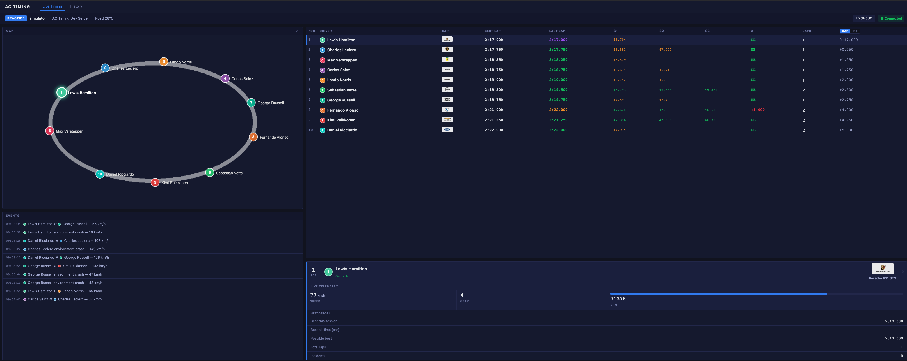

# AC Timing

> **Work in progress.** This project is in early development — expect rough edges, missing features, and breaking changes. Not production-ready.

A real-time race timing dashboard for [Assetto Corsa](https://www.assettocorsa.net/) dedicated servers. Connects to the AC UDP plugin protocol and presents a live leaderboard, track map, sector times, telemetry, and incident log in a browser-based UI.



---

## Features

- **Live leaderboard** — positions, best lap, last lap, gap/interval, lap count
- **Sector times** — spline-based S1/S2/S3 split with purple/green/yellow colour coding
- **Track map** — live car positions with driver dots
- **Driver panel** — selected driver telemetry (speed, gear, RPM), personal stats, possible best lap
- **Event log** — joins, disconnects, collisions with impact speed
- **Session info** — track, session type, temperature, countdown timer
- Works with vanilla AC dedicated server and [AC Server Manager](https://github.com/cj123/assetto-server-manager)

---

## Tech stack

- **.NET 10** — Blazor Server, ASP.NET Core
- **SignalR** — real-time push to the browser
- **EF Core + SQLite** — session persistence
- **UDP background service** — speaks the AC plugin protocol directly

---

## Getting started

### Requirements

- .NET 10 SDK
- An Assetto Corsa dedicated server with the UDP plugin enabled

### Run from source

```bash
git clone https://github.com/your-org/assetto-timing
cd assetto-timing
dotnet run --project src/Devlabs.AcTiming.Web
```

Open `http://localhost:5000` in a browser.

### AC server configuration

Add to `server_cfg.ini` on your AC server:

```ini
UDP_PLUGIN_LOCAL_PORT=9999
UDP_PLUGIN_ADDRESS=<timing-machine-ip>:9996
```

If the timing app runs on the same machine as AC, use `127.0.0.1`.

### Minimal `appsettings.json`

```json
{
  "Urls": "http://0.0.0.0:5000",
  "AcServer": {
    "UdpPort": 9996
  }
}
```

See [docs/configuration.md](docs/configuration.md) for the full reference including cross-machine setups, firewall ports, and logging options.

### Architecture

See [docs/architecture.md](docs/architecture.md) for a full system design walkthrough — event pipeline, enrichers, SignalR broadcast, persistence, and how to extend the system.

---

## Development simulator

No AC server? Use the built-in simulator to generate fake traffic:

```bash
dotnet run --project src/Devlabs.AcTiming.Simulator -- [port] [drivers] [tickMs]
```

| Argument | Default | Description |
|---|---|---|
| `port` | `9996` | UDP port to send to |
| `drivers` | `10` | Number of simulated drivers (max 10) |
| `tickMs` | `250` | Update interval in milliseconds |

Example — 6 drivers, 100 ms tick:

```bash
dotnet run --project src/Devlabs.AcTiming.Simulator -- 9996 6 100
```

---

## Building a self-contained binary

```bash
# Linux (x64)
dotnet publish src/Devlabs.AcTiming.Web -p:PublishProfile=linux-x64

# Windows (x64)
dotnet publish src/Devlabs.AcTiming.Web -p:PublishProfile=win-x64
```

Output lands in `publish/linux-x64/` or `publish\win-x64\`. Copy the entire folder to the target machine — no .NET runtime required.

---

## Project structure

```
src/
├── Devlabs.AcTiming              # Domain + application logic
├── Devlabs.AcTiming.Infrastructure  # UDP client, EF Core, services
├── Devlabs.AcTiming.Web          # Blazor Server UI + SignalR hub
└── Devlabs.AcTiming.Simulator    # Dev console simulator
tests/
└── Devlabs.AcTiming.Tests
docs/
├── architecture.md               # System design, event pipeline, enrichers
├── configuration.md              # Full config & deployment guide
└── ac-protocol.md                # AC UDP packet reference
```

---

## Known limitations / roadmap

- Sector times use equal-thirds spline split — not calibrated per track
- No historical lap browser (stored in DB, not yet surfaced in UI)
- No multi-session support
- Sector times require AC Server Manager or spline tracking; vanilla server has no mid-lap splits

---

## Contributing

Issues and PRs are welcome. This is a hobby project — don't expect fast responses, but feel free to open discussions for feature ideas or bugs.

---

## License

MIT — see [LICENSE](LICENSE) for details.
