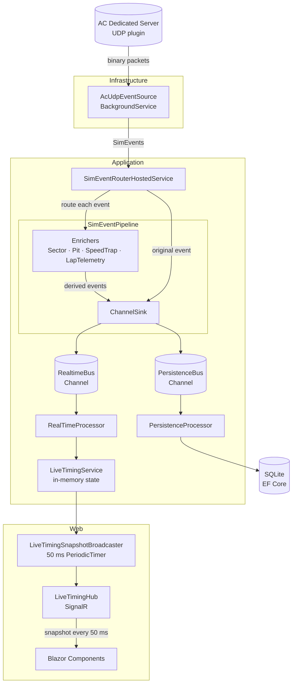
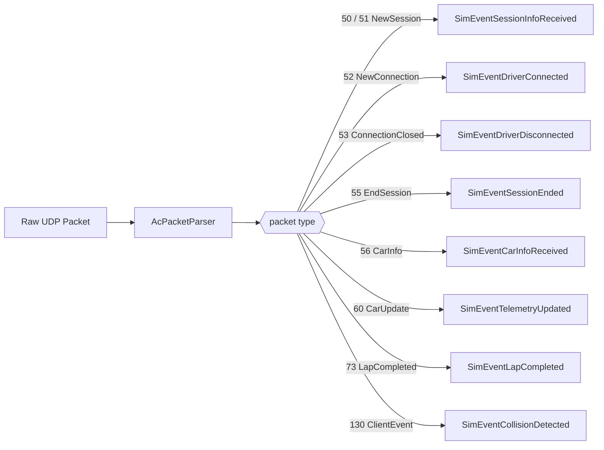
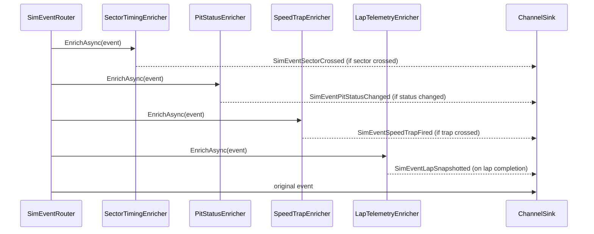
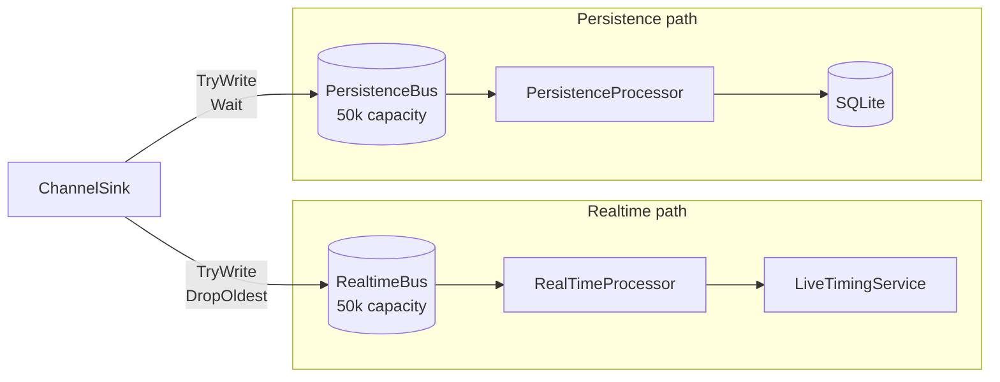
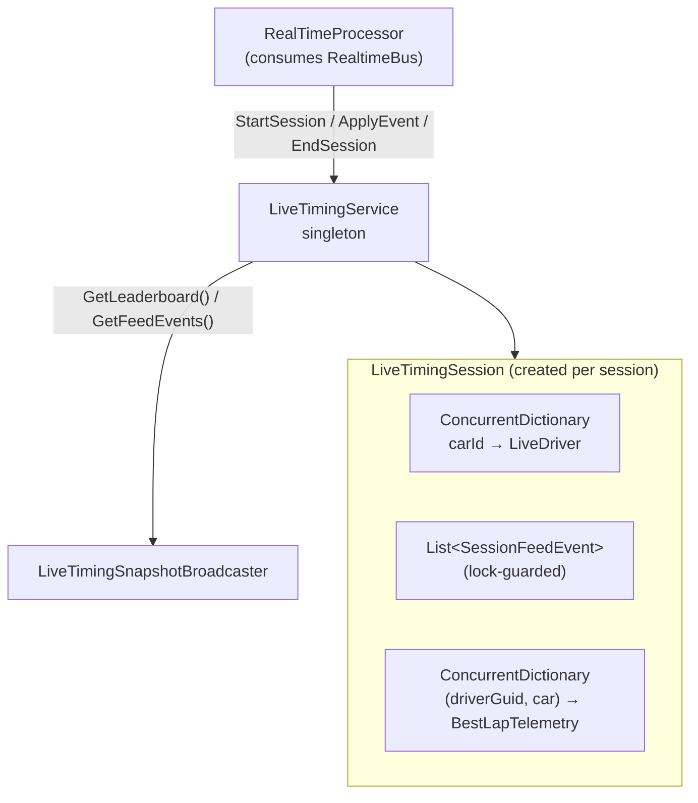
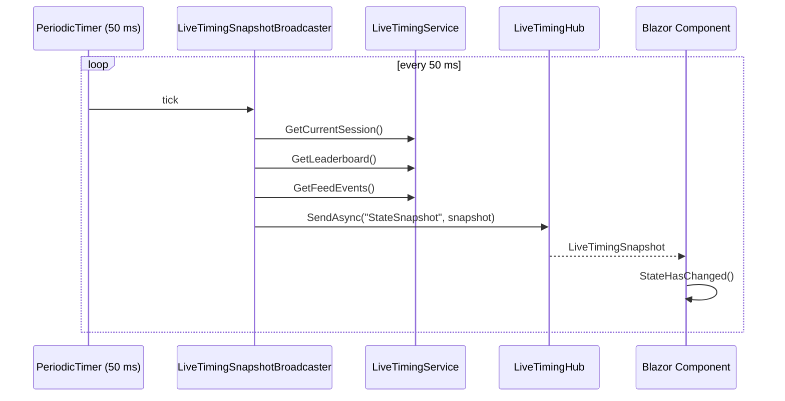
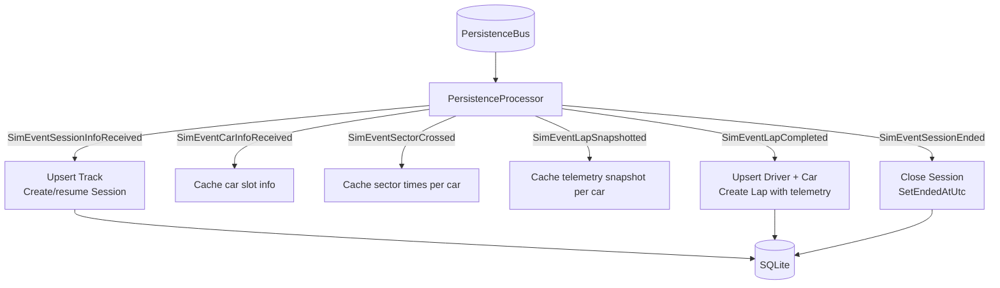

# Architecture Overview

This document is the entry point for new developers. It explains what the system does, how the pieces fit together, and how to extend it.

---

## FL42: The Big Picture

AC Timing receives UDP telemetry from an Assetto Corsa dedicated server, enriches it with domain logic (sector times, pit detection, speed traps), keeps live state in memory, broadcasts it to Blazor clients over SignalR, and persists sessions and laps to SQLite.



---

## Projects

| Project | Purpose |
|---------|---------|
| `Devlabs.AcTiming` | Domain models, application services, enrichment pipeline, LiveTiming state, persistence |
| `Devlabs.AcTiming.Infrastructure` | UDP event source, EF Core DbContext, migrations, car brand resolver |
| `Devlabs.AcTiming.Web` | Blazor Server host, SignalR hub, snapshot broadcaster, UI components |
| `Devlabs.AcTiming.Simulator` | Console app — simulates a full AC session locally without a real server |
| `Devlabs.AcTiming.Tests` | Unit and integration tests |

---

## 1. Event Source — UDP

**File:** `src/Devlabs.AcTiming.Infrastructure/AcServer/AcUdpEventSource.cs`

`AcUdpEventSource` is a `BackgroundService` that listens on a UDP port, parses raw AC protocol packets, and emits strongly-typed `SimEvent` records. It implements `ISimEventSource`, which exposes an `IAsyncEnumerable<SimEvent>` that the router consumes.



`AcUdpEventSource` can also **send** packets back to the server:

| Method | Packet | Effect |
|--------|--------|--------|
| `RequestSessionInfoAsync()` | GetSessionInfo (204) | Ask server to re-send session info |
| `RequestCarInfoAsync(carId)` | GetCarInfo (201) | Ask server for a specific car's driver info |
| `SendRealtimePosIntervalAsync()` | RealtimePosInterval (200) | Set the telemetry tick rate |

> The raw AC binary protocol is documented in [`ac-protocol.md`](ac-protocol.md).

---

## 2. Enrichment Pipeline

The pipeline is the heart of the application. It processes every event from the source, runs stateful enrichers that can produce *additional* events, and then publishes everything to the two event buses.

### Pipeline Execution Order



Enrichers run sequentially. Each can return zero or more derived events — those derived events go directly to the sink, not back through enrichers. Exceptions in one enricher do not break the others.

### Enricher Interface

```csharp
public interface ISimEventEnricher
{
    EnricherPhase Phase { get; }  // Pre or Post

    ValueTask<IReadOnlyList<SimEvent>> EnrichAsync(SimEvent @event, CancellationToken ct);
}
```

All four current enrichers use `Phase = EnricherPhase.Pre` (runs before the original event hits the sink). `Post` exists for future use (e.g. audit logging after persistence).

### Current Enrichers

| Enricher | Watches | Emits | State |
|----------|---------|-------|-------|
| `SectorTimingEnricher` | `SimEventTelemetryUpdated`, `SimEventLapCompleted` | `SimEventSectorCrossed` | Per-car sector tracker; interpolates crossing time between ticks |
| `PitStatusEnricher` | `SimEventTelemetryUpdated`, `SimEventSessionInfoReceived` | `SimEventPitStatusChanged` | Loads pit polygon from DB; point-in-polygon test per tick |
| `SpeedTrapEnricher` | `SimEventTelemetryUpdated`, `SimEventSessionInfoReceived` | `SimEventSpeedTrapFired` | Loads trap lines from DB; segment-segment intersection per tick |
| `LapTelemetryEnricher` | `SimEventTelemetryUpdated`, `SimEventLapCompleted` | `SimEventLapSnapshotted` | Buffers telemetry samples per car; snapshots on lap finish |

### How to Add an Enricher

1. Create `Application/EventRouting/Pipeline/Enrichers/YourFeature/YourEnricher.cs`:

```csharp
public sealed class YourEnricher : ISimEventEnricher
{
    public EnricherPhase Phase => EnricherPhase.Pre;

    public ValueTask<IReadOnlyList<SimEvent>> EnrichAsync(SimEvent @event, CancellationToken ct)
    {
        if (@event is not SimEventTelemetryUpdated telemetry)
            return ValueTask.FromResult<IReadOnlyList<SimEvent>>([]);

        // ... your logic ...

        SimEvent? derived = DetectSomething(telemetry);
        return ValueTask.FromResult<IReadOnlyList<SimEvent>>(
            derived is null ? [] : [derived]
        );
    }
}
```

2. If the enricher needs its own stateful tracker (the norm), create a companion `YourTracker.cs` in the same folder and register it as a singleton.

3. Register in `Application/DependencyInjection.cs`:

```csharp
services.AddSingleton<YourTracker>();

services.AddSimEventPipeline(config =>
{
    // ... existing enrichers ...
    config.AddEnricher<YourEnricher>();
});
```

4. If the enricher emits a new event type, define it in `Application/Shared/` inheriting from `SimEvent`:

```csharp
public sealed record SimEventYourThing(int CarId, ...) : SimEvent;
```

5. Handle the new event in `LiveTimingSession.Apply()` (realtime UI) and/or `PersistenceProcessor` (DB).

---

## 3. Event Catalogue

All events inherit from `SimEvent` (abstract record). Events from the UDP source are "raw"; events from enrichers are "derived".

| Event | Source | Key Fields |
|-------|--------|-----------|
| `SimEventSessionInfoReceived` | UDP | `TrackName`, `TrackConfig`, `Type`, `TimeLimitMinutes`, `LapLimit`, `AmbientTemp`, `RoadTemp`, `IsNewSession` |
| `SimEventSessionEnded` | UDP | _(none)_ |
| `SimEventDriverConnected` | UDP | `CarId`, `CarModel`, `CarSkin`, `DriverName`, `DriverGuid` |
| `SimEventDriverDisconnected` | UDP | `CarId`, `DriverName` |
| `SimEventCarInfoReceived` | UDP | `CarId`, `CarModel`, `CarSkin`, `DriverName`, `DriverGuid` |
| `SimEventTelemetryUpdated` | UDP | `CarId`, `SplinePosition`, `WorldX`, `WorldZ`, `SpeedKmh`, `Gear`, `EngineRpm` |
| `SimEventLapCompleted` | UDP | `CarId`, `LapTimeMs`, `Cuts`, `Leaderboard[]` |
| `SimEventCollisionDetected` | UDP | `CarId`, `OtherCarId?`, `ImpactSpeedKmh`, `CollisionType` |
| `SimEventSectorCrossed` | SectorTimingEnricher | `CarId`, `SectorIndex` (0 or 1), `SectorTimeMs`, `CompletedSectorsThisLap`, `IsValidLap` |
| `SimEventPitStatusChanged` | PitStatusEnricher | `CarId`, `IsInPit` |
| `SimEventSpeedTrapFired` | SpeedTrapEnricher | `CarId`, `TrapId`, `TrapName`, `SpeedKmh` |
| `SimEventLapSnapshotted` | LapTelemetryEnricher | `CarId`, `Samples[]`, `MaxSpeedKmh` |

---

## 4. Dual-Bus Architecture

After enrichment, every event is written to two independent channels:



| | RealtimeBus | PersistenceBus |
|---|---|---|
| **Full queue policy** | `DropOldest` — discards stale data to stay fresh | `Wait` — applies back-pressure to never lose events |
| **Consumer** | `RealTimeProcessor` | `PersistenceProcessor` |
| **Goal** | UI responsiveness, low latency | Data durability, completeness |

Decoupling the two paths means a slow DB write never blocks the live leaderboard.

---

## 5. In-Memory State (LiveTiming)



**`LiveTimingService`** is the singleton that:
- Creates/destroys a `LiveTimingSession` on session start/end
- Exposes `ApplyEvent(SimEvent)` for the processor to call
- Exposes read-only query methods for the broadcaster and Blazor components

**`LiveTimingSession`** is the per-session state machine:
- `ConcurrentDictionary<carId, LiveDriver>` — safe for UI thread reads without locking
- Handles every event type via its internal `Apply()` dispatcher
- Maintains best lap telemetry snapshots for the lap comparison feature

**`LiveDriver`** is an immutable record updated by replacing the dictionary entry. It carries: position, speed, gear, RPM, best/last lap times, sector times, pit status, incident count, max speed.

---

## 6. SignalR Broadcast



**`LiveTimingHub`** (`/hubs/timing`) is a thin marker — no methods to call, only server-push. The broadcaster uses `IHubContext<LiveTimingHub>` to push to all connected clients at 20 fps.

**`LiveTimingSnapshot`** contains:
- `SessionInfo?` — track, session type, temps, time/lap limit
- `IReadOnlyList<LiveDriver>` — full leaderboard
- `IReadOnlyList<SessionFeedEvent>` — recent feed events (joins, laps, crashes, pit, speed traps)

Blazor components connect to the hub in `OnInitializedAsync`, register a handler for `StateSnapshot`, and call `StateHasChanged()` on each push.

---

## 7. Persistence

**`PersistenceProcessor`** is a hosted service that consumes `PersistenceBus` and writes to SQLite via EF Core.



**Entity model:**

```
Track (name, config)
  └── Session (type, server, temps, start/end)
        └── Lap (driver FK, car FK, number, time, sectors, cuts, valid, telemetry, maxSpeed)

Driver (guid, name, team)   ← upserted per lap
Car (model, skin)           ← upserted per lap
```

`ITimingDb` is the repository abstraction used throughout the application layer. Inject it as a scoped service to query or write data.

---

## 8. Simulator

**Project:** `Devlabs.AcTiming.Simulator`

Simulates a full AC session (Practice, 10 GT3 drivers) without needing a real AC server. Useful during development when you need live traffic.

```bash
dotnet run --project src/Devlabs.AcTiming.Simulator -- [port] [drivers] [tickMs]

# Examples
dotnet run --project src/Devlabs.AcTiming.Simulator          # 10 drivers, 250 ms
dotnet run --project src/Devlabs.AcTiming.Simulator -- 9996 5 100  # 5 drivers, 100 ms
```

**What it simulates:**
- Session start (Practice @ test track with elliptical geometry)
- 10 named GT3 drivers with unique cars and realistic lap times (~2 min ±2 s)
- Continuous telemetry (position, speed, gear, RPM along an elliptical path)
- Lap completions with cut count
- Pit lane entries (~8% chance per lap): entry → drive-through → box stop (5 s) → exit
- Car-vs-car and car-vs-environment collisions (~1 per 17 s)

---

## 9. Startup & DI

Hosted services start in registration order:

```
1. AcUdpEventSource            ← opens UDP socket, starts receiving
2. SimEventRouterHostedService ← starts routing events through pipeline
3. RealTimeProcessor           ← starts consuming RealtimeBus
4. PersistenceProcessor        ← starts consuming PersistenceBus
5. LiveTimingSnapshotBroadcaster ← starts 50 ms broadcast timer
```

DB migrations run automatically on startup (`MigrateAsync()`), so there's no manual migration step.

---

## 10. Key Design Decisions

| Decision | Why |
|----------|-----|
| **Dual-bus (Realtime + Persistence)** | Slow DB writes must not stall the live UI. DropOldest on realtime keeps it fresh; Wait on persistence ensures no data loss. |
| **Enricher pattern** | Each concern (sectors, pit, speed traps, telemetry) is isolated, independently testable, and opt-in via DI registration. |
| **Pre-enrichers emit before sink** | Derived events (e.g. `SimEventSectorCrossed`) reach both buses alongside the original event, so both realtime and persistence consumers see the full picture. |
| **Point-in-polygon for pit** | More accurate than a spline range; the polygon is user-defined via the Track Config tool and stored in the DB. |
| **Segment-intersection for speed traps** | Robust to variable tick rate — detects a crossing between two telemetry frames even at low update frequency. |
| **Concurrent reads, sequential writes** | `LiveTimingSession._drivers` uses `ConcurrentDictionary` so Blazor threads read lock-free. The single pipeline thread is the only writer. |
| **Immutable `LiveDriver` record** | Updates are atomic dictionary replacements, eliminating partial-read races without locking. |
| **20 fps SignalR broadcast** | Full state push (not deltas) every 50 ms keeps client logic simple. At typical leaderboard sizes the payload is tiny. |
